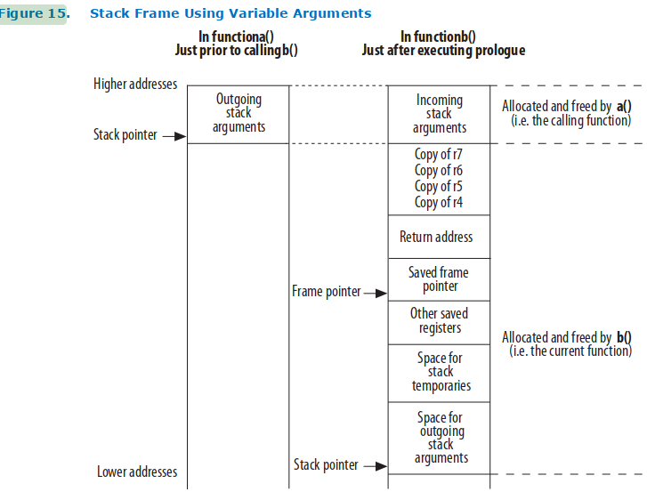

prep:

Preparatory:
1.

  1. r16-r23 are calee-saved
  2. r8-r15 are caller-saved
  3. sp is used as the stack pointer
  4. points to last used slot
  5. ra is the "return" address. It is passed from the caller to the callee by having the caller push it onto the stack. The callee restores at the end of the function call.
  6. Arguments are passed via r4-r7
  7. r2 (and r3 for 64-bit) is the return value
  8. child's stack frame is from the Frame Ptr label under the "in fuctionb()" heading to the top. Simplifies the algorithm for retrieving fn arguments by consolidating all arguments into stack frame instead of having some in registers and some in the stack

2. 

r4: 0x2000
r5: 8
r6: 9
r7: 10
ra: 

     

   
   

 0(sp):  16            
 4(sp):  15            
 8(sp):  14            
12(sp):  13            
16(sp):  12            
20(sp):  11            
24(sp):  10           
28(sp):  9            
32(sp):  8             
36(sp):  0x2000        
36(sp):  <return addr>
36(sp):  <frame ptr>   

3.

